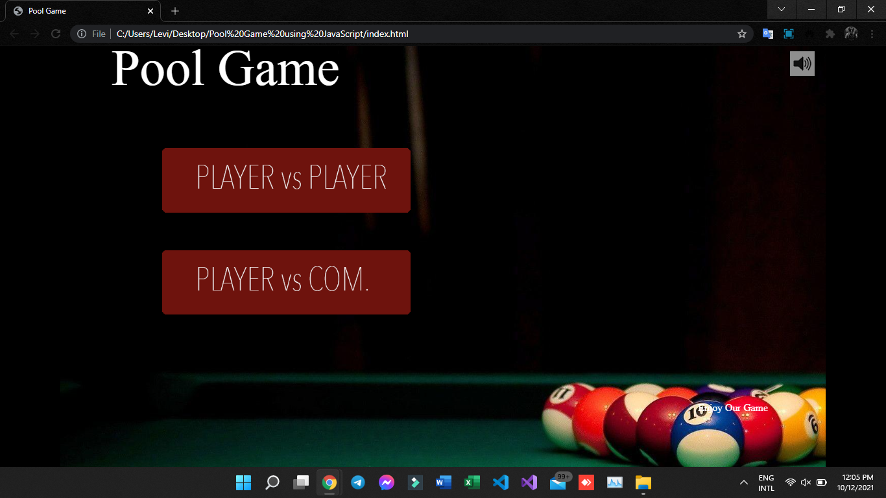
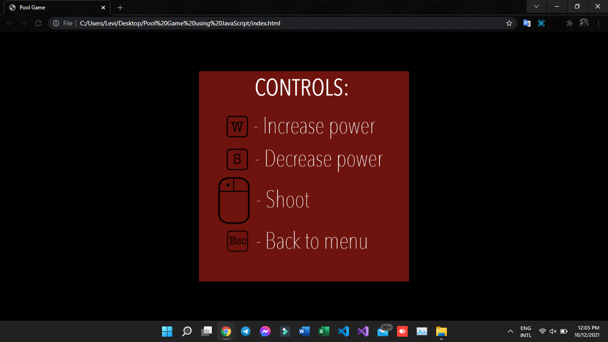
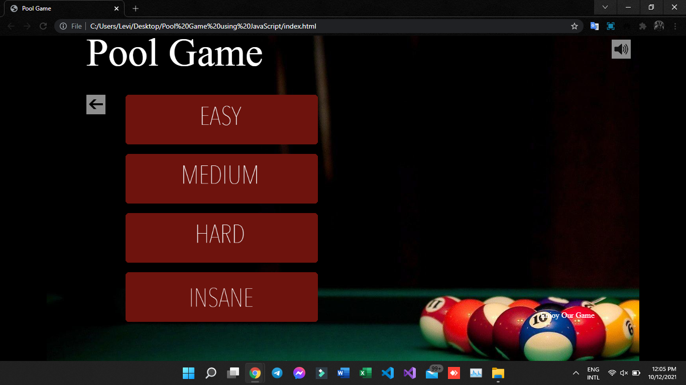
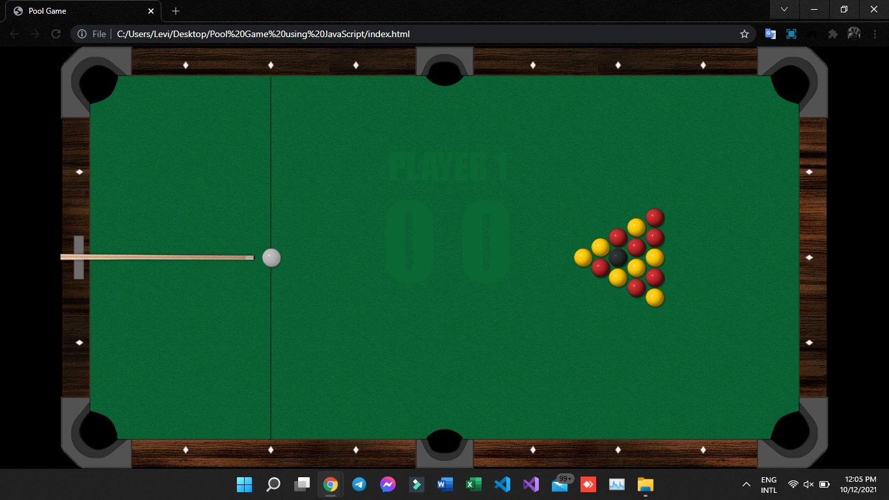

# Pool Game using JavaScript

Language #JavaScript

Pool Game with Source Code is a project that is a multi-player game where your only goal is to put all the color ball in the hole. The game has a basic design that contains image sprites and text. The purpose of the project is to have some entertain and leisure time with your friends.

# About the System
The Pool Game was created in a HTML web browser that use JavaScript to enhance the interactive user experience by giving a newly impact for web developing. The game is playable through web browser that visualize only text and buttons. The player can play the game via Keyboard (W Key to Increase the Power Shot, S Key to Decrease the Power Shot, Left Mouse Button to Trigger the Pool). The player will win the game if he/she put all the colored balls in the hole. The game is inspired from the original pool game that adapt the rules and gameplay of that particular game to this web application. This game is for education purpose only. The game is fun to play with your friend or either AI control, you can choose the difficulty for the AI control whether Easy, Medium, Hard. The Pool Game was created using basic JavaScript coding structure that help beginners to understand the system.

# Pool Game using JavaScript Features:
* Simple GUI
* The project contains simple UI such text, buttons and images.
* Basic Controls
* This project uses a basic control that needed to interact with the game.
* User-friendly Interface
* This project was design in a simple user-friendly interface web application.
* Ai Control
* This project contains an AI control that can extend the difficulty of the game.

The Pool Game was developed using JavaScript language. I hope that this system can help you to what you are looking for. For more updates and tutorials just kindly visit this site. Enjoy coding!!

